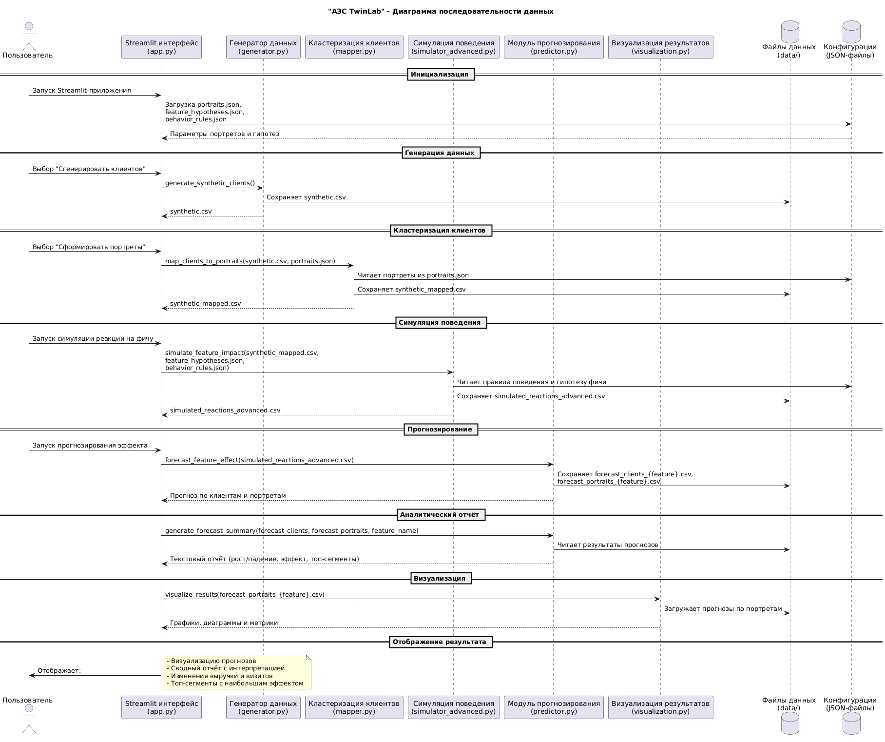

# ⛽АЗС TwinLab⛽

**АЗС TwinLab** – это интерактивное приложение для генерации синтетических данных о клиентах и автоматического сопоставления их с предопределёнными "портретами" пользователей.  
Проект разработан для демонстрации принципов синтетического моделирования данных, сегментации и визуализации результатов.

Ссылка на решение: <https://azs-client-synth-404.streamlit.app/>

---

## Основные возможности

- Генерация набора синтетических данных (`synthetic.csv`) с характеристиками клиентов.  
- Загрузка пользовательского CSV-файла с анонимизированными клиентами.  
- Сопоставление клиентов с готовыми портретами (моделями поведения).  
- Визуализация распределения клиентов по портретам.  
- Экспорт результатов маппинга в CSV.

---

## Структура проекта и описание файлов

### **data/**

Хранилище для входных и выходных данных.

- **synthetic.csv** – автоматически генерируемый набор синтетических клиентов (1000 записей по умолчанию).  
- **synthetic_mapped.csv** – результат сопоставления (маппинга) клиентов с портретами. Создаётся после обработки в Streamlit.

---

### **src/**

Исходный код проекта.

#### **app.py**

Главное приложение, запускаемое через Streamlit.  
Реализует интерфейс и взаимодействие пользователя с остальными модулями проекта.

Основные функции:

- Загрузка/генерация исходных данных.  
- Отображение превью таблицы.  
- Запуск функции маппинга клиентов к портретам.  
- Построение графика распределения (через Plotly).  
- Экспорт данных в CSV через кнопку `Скачать`.

Запуск:

```bash
streamlit run src/app.py
````

---

#### **generator.py**

Модуль генерации синтетических клиентов.
Создаёт DataFrame с псевдореальными параметрами (например, возраст, пол, регион, частота покупок и т.д.).

Основная функция:

```python
generate_clients(n: int) -> pd.DataFrame
```

Принимает количество клиентов и возвращает DataFrame с синтетическими записями.

Результат сохраняется в `data/synthetic.csv`.

---

#### **mapper.py**

Модуль для "маппинга" клиентов на заранее определённые портреты пользователей.

Основные функции:

```python
load_portraits(path: str) -> dict
map_clients_to_portraits(df: pd.DataFrame, portraits: dict) -> pd.DataFrame
```

- `load_portraits` загружает файл `portraits.json`.

- `map_clients_to_portraits` применяет правила сопоставления клиентов с конкретными портретами (на основе признаков).

Результат – DataFrame с добавленным полем `assigned_portrait`.

---

#### **portraits.json**

Файл с описанием портретов пользователей (например, "Активный водитель", "Редкий клиент", "Покупатель премиум-сегмента" и т.п.).

Каждый портрет может включать ключевые признаки:

```json
{
    "id": "rational_driver",
    "name": "Рациональный водитель",
    "desc": "Снижает расходы, реагирует на скидки",
    "prototype": {
      "age": 40,
      "avg_check": 900,
      "visits_per_month": 2.0,
      "distance_km": 8.0,
      "uses_app": 1,
      "prefers_coffee": 0
    }
  }
```

Используется функцией `load_portraits()` в `mapper.py`.

---

#### ****init**.py**

Пустой файл, отмечающий папку `src` как Python-пакет.
Необходим для корректных импортов модулей (`from src.generator import generate_clients`).

---

### **requirements.txt**

Список зависимостей проекта.

Содержимое:

```txt
pandas
numpy
scikit-learn
faker
streamlit
plotly
```

Для установки:

```bash
pip install -r requirements.txt
```

### Последовательность данных



---

## ⚡Запуск проекта⚡

1. Клонировать репозиторий или скачать проект.
2. Создать и активировать виртуальное окружение:

   ```bash
   python -m venv venv
   venv\Scripts\activate
   ```

3. Установить зависимости:

   ```bash
   pip install -r requirements.txt
   ```

4. Запустить Streamlit-приложение:

   ```bash
   streamlit run src/app.py
   ```

После запуска в терминале появится ссылка, например:

``` txt
Local URL: http://localhost:8501
```

Открой её в браузере.

---

## Пример работы

1. Нажать **“Сгенерировать synthetic.csv (1000)”**.
2. Просмотреть таблицу с синтетическими клиентами.
3. Нажать **“Сопоставить с портретами”**.
4. Увидеть график распределения и таблицу соответствий.
5. Скачать итоговый CSV.

---

## Команда проекта

Проект подготовлен в рамках хакатона **«Моя профессия – IT 2025»**.

Команда-разработчик: **«404: Имя не найдено»**.

Основная цель – продемонстрировать применение генерации синтетических данных и автоматической классификации клиентов по поведенческим моделям.
